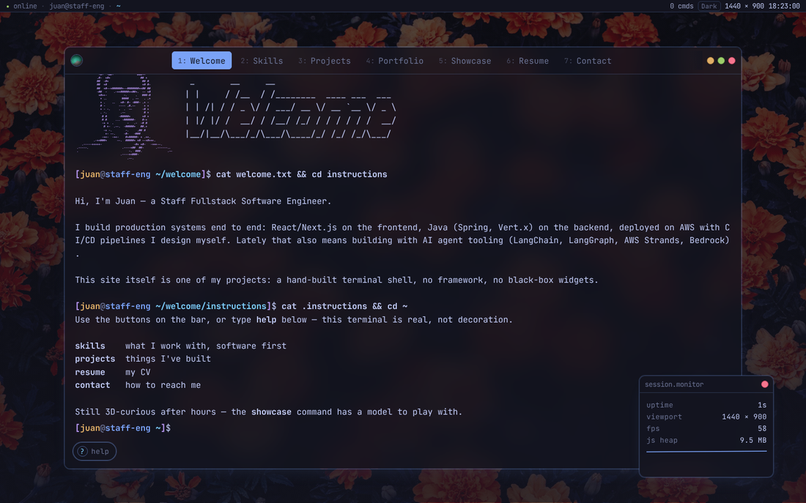

# juan@staff-eng

[](https://github.com/design3d-blender/website/actions/workflows/deploy.yml)


My portfolio site: a terminal you can actually type into, not a static page
pretending to be one.



**[Live demo →](https://design3d-blender.github.io/website/)**

Built with TypeScript + Vite, no UI framework. The buttons on the bar and the
command shell underneath both drive the same set of actions — there's no
duplicated logic between them. Content (skills, experience, projects) lives
as typed data in `src/content/`, so updating the site is "edit a data file,
push, CI builds and deploys it."

## Features

- **A real shell** — typed commands, tab-completion, ↑ / ↓ history, and a
  tiny virtual filesystem (`ls`, `cd`, `cat`)
- **A desktop environment** around it: a draggable window, a dock, an
  OS-style status bar, and a session-monitor widget that shows _real_
  signals (live FPS, uptime, viewport size, JS heap) — never fake decoration
- **Easter eggs** — a boot sequence on load, a konami-code trigger, a hidden
  mini-game, and a few joke Unix commands
- **Three themes** (dark / light / matrix), fully responsive down to small
  phones
- **Zero black-box widgets** — the window chrome, lightbox, and shell are
  all hand-written, not pulled from a component library

## Try it

- `help` — list every command
- `whoami`, `skills`, `projects`, `contact`, `resume` — jump straight to a
  section
- `ls` / `cd` / `cat` — the site is also a tiny virtual filesystem
- `showcase` — loads an interactive 3D model (three.js, fetched lazily,
  only when you open it)
- `neofetch` — yes, really
- Tab-completion and command history (↑ / ↓) work like a real shell

## Architecture

```
src/
├── main.ts              boot: wires nav buttons + the terminal shell together
├── config.ts             prompt identity, external links
├── content/               typed data — the only files you edit for content updates
├── terminal/
│   ├── shell.ts           command registry, parser, history, tab-completion
│   ├── commands/           one module per command
│   ├── renderer.ts         typewriter output renderer
│   └── prompt-line.ts       the live, editable command prompt
├── ui/                     window chrome, dock, osbar, help panel, theme switcher
├── showcase/               three.js model viewer (dynamic import)
└── styles/                 plain CSS, split by concern
```

The only runtime dependency is `three`, and it's dynamic-imported so it
never loads unless the 3D showcase is opened. Everything else — the shell,
the lightbox, the window chrome — is hand-written, no UI framework.

## Development

```
npm install
npm run dev       # local dev server
npm test          # vitest
npm run lint      # eslint + prettier check
npm run build     # typecheck + production build to dist/
```

## Deployment

Pushing to `main` runs lint, tests, and build, then deploys `dist/` to
GitHub Pages via `actions/deploy-pages` (see `.github/workflows/deploy.yml`).
The site is served from the GitHub Pages project subpath
(`design3d-blender.github.io/website/`) — no custom domain.
